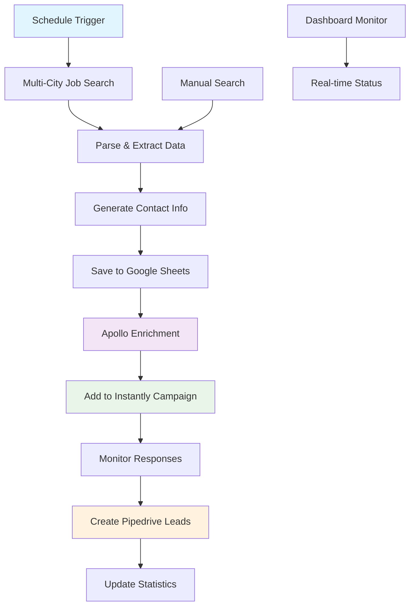

# 🚀 Job Automation System

**Intelligent German Job Search & Lead Generation Platform**

> Automated job discovery from Bundesagentur für Arbeit with contact enrichment, email campaigns, and CRM integration

[](https://nodejs.org/)
[](https://reactjs.org/)
[](https://www.typescriptlang.org/)
[](LICENSE)

## 📋 Table of Contents

- [Features](#-features)
- [Quick Start](#-quick-start)
- [Configuration](#️-configuration)
- [API Documentation](#-api-documentation)
- [Automation Workflow](#-automation-workflow)
- [Architecture](#️-architecture)
- [Troubleshooting](#-troubleshooting)
- [Contributing](#-contributing)

## 🎯 Features

### 🔍 **Job Discovery**
- **Bundesagentur für Arbeit API** integration for comprehensive German job search
- **Multi-city search** with intelligent filtering
- **Real-time job parsing** with enhanced contact extraction
- **Smart salary estimation** based on position type and market data
- **Automatic URL generation** for all job listings

### 📊 **Data Management**
- **Google Sheets integration** for centralized job storage
- **Batch processing** for large datasets (up to 200 jobs at once)
- **Real-time statistics** and performance tracking
- **Automatic data deduplication**

### 🤖 **Contact Enrichment**
- **Apollo.io integration** for contact discovery
- **Smart email generation** from company names
- **Phone number extraction** from job descriptions
- **Contact validation** and scoring

### 📧 **Email Automation**
- **Instantly.ai integration** for email campaigns
- **Response tracking** and lead scoring
- **A/B testing** capabilities
- **Bounce handling** and list management

### 💼 **CRM Integration**
- **Pipedrive integration** for lead management
- **Automatic pipeline** progression
- **Deal creation** from positive responses
- **Activity tracking** and reporting

### 🎛️ **Management Dashboard**
- **Real-time monitoring** of all processes
- **Visual analytics** and performance metrics
- **Automation scheduling** with cron patterns
- **Configuration management** interface

## 🚀 Quick Start

### Prerequisites

- **Node.js** 16+ and npm
- **Google Cloud Project** with Sheets API enabled
- **API keys** for Apollo.io, Instantly.ai, and Pipedrive

### Installation

1. **Clone and setup:**
```bash
cd "product pro"
npm run install-all
```

2. **Configure environment:**
```bash
cp env.example .env
```

3. **Set up Google Sheets:**
   - Create service account in Google Cloud Console
   - Download credentials JSON
   - Place in `credentials/google-sheets-credentials.json`
   - Create Google Spreadsheet and share with service account

4. **Start the application:**
```bash
# Development mode
npm run dev

# Production mode
npm run build
npm start
```

**Access:** Frontend at `http://localhost:3000`, Backend at `http://localhost:3001`

## ⚙️ Configuration

### Environment Variables

```env
# Bundesagentur API
BUNDESAGENTUR_API_URL=https://rest.arbeitsagentur.de/jobboerse/jobsuche-service
BUNDESAGENTUR_CLIENT_ID=jobboerse-jobsuche

# Google Sheets
GOOGLE_SHEETS_SPREADSHEET_ID=your_spreadsheet_id
GOOGLE_APPLICATION_CREDENTIALS=./credentials/google-sheets-credentials.json

# Apollo.io
APOLLO_API_KEY=your_apollo_api_key

# Instantly.ai
INSTANTLY_API_KEY=your_instantly_api_key

# Pipedrive
PIPEDRIVE_API_TOKEN=your_pipedrive_token
PIPEDRIVE_COMPANY_DOMAIN=your_company_domain

# Application
PORT=3001
NODE_ENV=development
LOG_LEVEL=info
```

### Google Sheets Setup

1. **Create Google Cloud Project:**
   - Go to [Google Cloud Console](https://console.cloud.google.com/)
   - Enable Google Sheets API
   - Create Service Account
   - Download JSON credentials

2. **Spreadsheet Configuration:**
   - Create new Google Spreadsheet
   - Share with service account email
   - Grant "Editor" permissions
   - Copy spreadsheet ID from URL

### API Keys Setup

#### Apollo.io
- Register at [Apollo.io](https://www.apollo.io)
- Navigate to Settings > API
- Copy your API key

#### Instantly.ai
- Log into [Instantly.ai](https://instantly.ai)
- Go to Settings > API
- Generate API key

#### Pipedrive
- Access your Pipedrive account
- Go to Settings > Personal preferences > API
- Copy API token
- Note your company domain

## 📚 API Documentation

### Jobs API

#### Search Jobs
```http
POST /api/jobs/search
Content-Type: application/json

{
  "keywords": "software developer",
  "location": "Berlin",
  "radius": 50,
  "size": 50,
  "publishedSince": "30",
  "employmentType": "VOLLZEIT"
}
```

**Response:**
```json
{
  "success": true,
  "data": {
    "jobs": [
      {
        "id": "job_id",
        "title": "Senior Software Developer",
        "company": "Tech Company GmbH",
        "location": "Berlin",
        "salary": "70.000 - 90.000 € brutto/Jahr",
        "contactEmail": "hr@techcompany.de",
        "externalUrl": "https://...",
        "publishedDate": "2024-01-15"
      }
    ],
    "totalCount": 156,
    "searchParams": {...}
  }
}
```

### Automation API

#### Run Automation
```http
POST /api/automation/run
Content-Type: application/json

{
  "searchParams": {
    "keywords": "software",
    "location": "Deutschland"
  },
  "enableEnrichment": true,
  "enableInstantly": true,
  "enablePipedrive": true
}
```

#### Schedule Automation
```http
POST /api/automation/schedule
Content-Type: application/json

{
  "cronPattern": "0 9 * * 1-5",
  "searchParams": {...},
  "options": {...}
}
```

#### Get Status
```http
GET /api/automation/status
```

**Response:**
```json
{
  "success": true,
  "data": {
    "isRunning": false,
    "isScheduled": true,
    "nextRun": "2024-01-16T09:00:00.000Z",
    "stats": {
      "totalRuns": 25,
      "successfulRuns": 24,
      "failedRuns": 1,
      "lastRunStatus": "success"
    }
  }
}
```

### Google Sheets API

#### Save Jobs
```http
POST /api/sheets/save-jobs
Content-Type: application/json

{
  "jobs": [...]
}
```

#### Get Statistics
```http
GET /api/sheets/stats
```

## 🔄 Automation Workflow



### Automation Steps

1. **Job Discovery**
   - Search across major German cities
   - Apply intelligent filters
   - Parse job details and requirements

2. **Data Enhancement**
   - Extract contact information
   - Generate company emails
   - Estimate salary ranges
   - Create fallback URLs

3. **Storage & Organization**
   - Batch save to Google Sheets
   - Deduplicate entries
   - Update processing status

4. **Contact Enrichment**
   - Apollo.io contact discovery
   - Validate email addresses
   - Find additional contact details

5. **Campaign Management**
   - Add to Instantly campaigns
   - Track email performance
   - Monitor responses

6. **Lead Generation**
   - Create Pipedrive deals
   - Set pipeline stages
   - Track conversion rates

## 🏗️ Architecture

### Project Structure
```
product pro/
├── server/                 # Node.js Backend
│   ├── routes/            # API endpoints
│   │   ├── jobs.js        # Job search & management
│   │   ├── automation.js  # Automation control
│   │   ├── sheets.js      # Google Sheets integration
│   │   └── config.js      # Configuration management
│   ├── services/          # Business logic
│   │   ├── bundesagenturService.js  # Job API integration
│   │   ├── googleSheetsService.js   # Sheets operations
│   │   ├── automationService.js     # Workflow management
│   │   ├── apolloService.js         # Contact enrichment
│   │   ├── instantlyService.js      # Email campaigns
│   │   └── pipedriveService.js      # CRM integration
│   ├── utils/             # Utilities
│   │   └── logger.js      # Winston logging
│   └── index.js           # Express server
├── client/                # React Frontend
│   ├── src/
│   │   ├── components/    # UI components
│   │   │   ├── Dashboard.tsx        # Main dashboard
│   │   │   ├── JobSearch.tsx        # Search interface
│   │   │   ├── AutomationControl.tsx # Automation management
│   │   │   ├── Statistics.tsx       # Analytics view
│   │   │   └── Configuration.tsx    # Settings panel
│   │   ├── services/      # API client
│   │   │   └── api.ts     # Axios configuration
│   │   └── App.tsx        # Main application
├── credentials/           # API credentials (gitignored)
├── logs/                  # Application logs
└── README.md
```

### Technology Stack

**Backend:**
- **Node.js** with Express.js
- **Winston** for structured logging
- **Axios** for HTTP clients
- **Google APIs** for Sheets integration
- **Cron** for job scheduling

**Frontend:**
- **React 19** with TypeScript
- **Custom CSS** with responsive design
- **Heroicons** for UI icons
- **Axios** for API communication

**External APIs:**
- **Bundesagentur für Arbeit** - Job search
- **Google Sheets API** - Data storage
- **Apollo.io API** - Contact enrichment
- **Instantly.ai API** - Email automation
- **Pipedrive API** - CRM integration

## 🔧 Troubleshooting

### Common Issues

#### ❌ "Google Sheets credentials not found"
**Solution:**
1. Verify `credentials/google-sheets-credentials.json` exists
2. Check service account permissions
3. Ensure spreadsheet is shared with service account

#### ❌ "API request failed with 400"
**Solution:**
1. Check `.env` configuration
2. Verify API keys are valid
3. Review request parameters in logs

#### ❌ Frontend shows 0 results
**Solution:**
1. Use German keywords for better results
2. Try broader search terms (e.g., "software" vs "software developer engineer")
3. Check backend logs for API errors

#### ❌ Automation not running
**Solution:**
1. Verify cron pattern syntax
2. Check automation status in dashboard
3. Review logs for error messages

### Performance Optimization

**Large Job Datasets:**
- Use batch processing (200 jobs max per request)
- Enable request compression
- Monitor memory usage

**API Rate Limits:**
- Apollo: 100 requests/minute
- Instantly: Varies by plan
- Pipedrive: 100 requests/10 seconds

### Logging

Logs are stored in `logs/` directory:
- `combined.log` - All log levels
- `error.log` - Error level only

**Log Levels:** error, warn, info, debug

## 🤝 Contributing

### Development Setup

1. **Fork and clone** the repository
2. **Install dependencies:** `npm run install-all`
3. **Set up environment** variables
4. **Run tests:** `npm test`
5. **Start development:** `npm run dev`

### Code Standards

- **ESLint** configuration for code quality
- **TypeScript** for type safety
- **Winston** for consistent logging
- **Error handling** with try-catch blocks

### Pull Request Process

1. Create feature branch
2. Add tests for new functionality
3. Update documentation
4. Submit PR with clear description

## 📄 License

This project is licensed under the MIT License - see the [LICENSE](LICENSE) file for details.

## 🙏 Acknowledgments

- **Bundesagentur für Arbeit** for providing the job search API
- **Google** for Sheets API and cloud services
- **Apollo.io**, **Instantly.ai**, **Pipedrive** for integration APIs
- **Open source community** for the amazing tools and libraries

---

**⚠️ Important:** This is an MVP version. For production use, implement additional security measures, comprehensive error handling, and monitoring systems.

**🔗 Quick Links:**
- [Live Demo](#) (Coming soon)
- [API Documentation](#-api-documentation)
- [Issue Tracker](../../issues)
- [Changelog](CHANGELOG.md)

Made with ❤️ for the German job market 